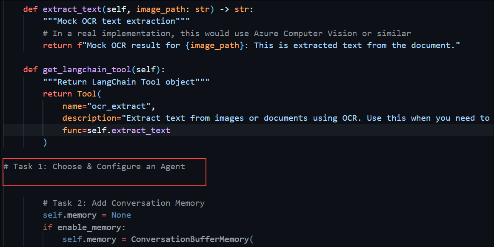
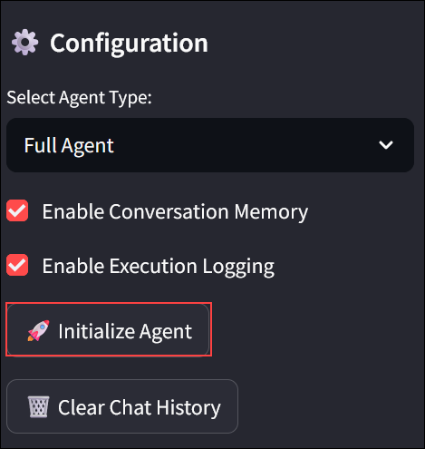
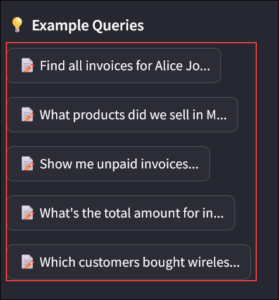
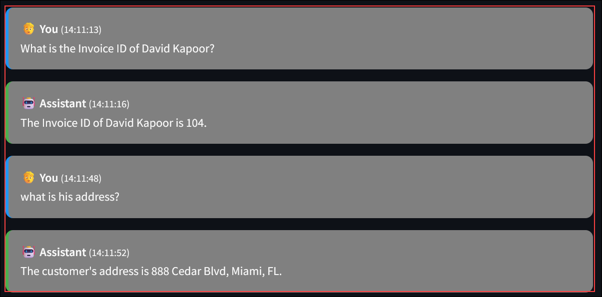
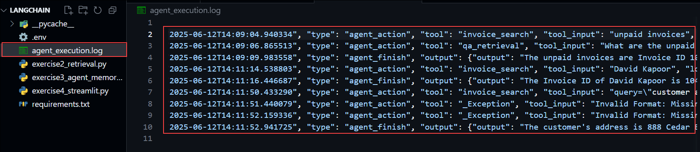

# Knowledge-Augmented Chatbot with LangChain & Azure AI Search

### Overall Estimated Duration: 2 Hours

## Overview

In this lab, you will build a knowledge-augmented chatbot that combines Azure AI Search with a powerful language model using LangChain. You will ingest sample documents and images, index them using Azure AI Search (with built-in OCR for images), and create a retrieval-augmented generation (RAG) chatbot that responds to user queries using this indexed data. You'll build LangChain tools and chains to query your index, assemble an agent with memory and observability, and finally run the chatbot locally using Streamlit to test multi-turn interactions.

## Objective

Learn to build and automate a knowledge-augmented chatbot using LangChain and Azure AI, leveraging tools like vector search, language models, and multi-turn agent planning. By the end of this lab, you will:

- **Content Ingestion & Index Creation:** Understand how to ingest, enrich, and index documents and images using Azure AI Search with OCR and skillsets

- **LangChain Tools & Retrieval Chain:** Gain insights into building a retrieval-augmented chatbot that grounds answers in enterprise content

- **Agent Assembly & Memory:** Build a LangChain agent equipped with tools and conversation memory to support multi-turn, contextual interactions

- **Deployment as an Azure Function:** Deploy and test your intelligent chatbot locally using Streamlit for rapid prototyping and prompt testing

## Pre-requisites

Participants should have the following prerequisites:

- **Familiarity with Azure Resources:** Basic understanding of Azure services and the Azure portal for managing cloud resources.

- **Knowledge of python:** Familiarity working with python.

## Architecture

The architecture enables end-to-end knowledge-augmented chatbot development by seamlessly ingesting, processing, indexing, and querying both documents and images using Azure AI Search and LangChain. Invoices and other documents added as searchable knowledge sources. Retrieval and reasoning are orchestrated through LangChain agents and large language models to enable contextual, multi-turn conversations. Finally, the agent is exposed through a lightweight Streamlit interface, delivering intelligent, grounded responses in a familiar, interactive format—ideal for rapid prototyping and enterprise integration.

## Architecture Diagram


## Explanation of Components

The architecture for this lab involves several key components:

- **Azure AI Search:** Serves as the core indexing and retrieval engine for your chatbot. It ingests documents and images, applies built-in cognitive skills like OCR and text extraction, and enables fast semantic search over your content. LangChain connects to Azure AI Search to retrieve the most relevant content snippets during chatbot interactions.

- **Azure OpenAI:** Provides large language models (LLMs) such as GPT-4, which power the chatbot's natural language understanding and generation. Integrated through LangChain, Azure OpenAI generates accurate, grounded responses by synthesizing user queries with content retrieved from Azure AI Search.

- **Visual Studio Code:** Acts as the primary development environment for building, testing, and debugging your LangChain-powered chatbot. With built-in terminal support and extensions for Python, Azure, and Streamlit, Visual Studio Code streamlines the entire development workflow—from writing LangChain scripts to launching a local chatbot interface.

- **Langchain:** is a framework that simplifies building AI applications by connecting language models (like those from OpenAI) with external data, tools, and memory. It enables developers to create context-aware, interactive apps that can retrieve information, process queries, and maintain conversation history.

## Exercise 1: Content Ingestion & Index Creation

### Estimated Duration: 30 Minutes

## Overview

In this exercise, you will prepare your data foundation by uploading sample PDFs and images to Azure Blob Storage, and configuring Azure AI Search to ingest and process them. Using built-in OCR and text extraction capabilities, Azure AI Search will enrich the content and generate a searchable index. This indexed data will serve as the knowledge base for your chatbot, enabling grounded, document-aware responses in later exercises.

**Azure AI Search** service is a tool that uses artificial intelligence to quickly find and retrieve relevant information from large datasets, like documents or databases. It understands user queries, even if they're vague, and delivers accurate results by analyzing content and context. Think of it as a super-smart librarian who instantly finds the right books for you. For example, Azure AI Search can search invoices by customer name or product, making data retrieval fast and intuitive.

## Objectives

You will be able to complete the following tasks:

- Task 1: Define & Populate Search Index

## Task 1 : Define & Populate Search Index

In this task, you will ingest the data into Azure AI Search from the storage account and create an index using that. This will be used as the initial knowledge for retrival.

1. Once you are in the Azure Portal, scroll down and under Navigate, select **Resource groups** option.

   

1. Now, from the list, select **langchain-<inject key="Deployment ID" enableCopy="false"/>** resource group.

   

1. From the resource list, click on **aisearch-<inject key="Deployment ID" enableCopy="false"/>** AI Search service.

   

1. Once you are in the overview page of AI Search, click on **Import data**.

   

1. In **Connect to your data** pane, for **Data Source**, select **Azure Blob Storage** from the list.

   

1. In next pane, for **Skillset name (1)**, provide the name as `invoice-skillset`, make sure for Text Cognitive Skills, check the boxes for the options as Shown and Click on **Next: Customize target index (3)**.

   

1. In the next pane, provide the **Index name** as `invoice-index` **(1)** and click on **Next: Create an indexer (2)**.

   

1. In **Create an indexer** pane, provide the name as `invoice-indexer` **(1)** and click on **Submit (2)**.

   

1. Now, navigate to index page, select **Indexes** from the left menu, under **Search Management** and click on **invoice-index**.

   

   >**Note:** wait till the data is imported completly in the index (Till the document count is populated to some number).

1. Once you open the index, click on **Search**, this will search for all the documents and fields. You can goo through the output and check how the data is extracted and added in indexes.

   

## Summary

In this exercise, you prepared your data foundation by uploading sample PDFs and images to Azure Blob Storage and configuring Azure AI Search to ingest and process them. Using built-in OCR and text extraction capabilities, Azure AI Search enriched the content and generated a searchable index. This indexed data now serves as the knowledge base for your chatbot, enabling grounded, document-aware responses in later exercises.

## Exercise 2: LangChain Tools & Retrieval Chain

### Estimated Duration: 30 Minutes

## Overview

In this exercise, you will integrate Azure AI Search with LangChain by wrapping your search index as a retriever and building a RetrievalQA chain powered by Azure OpenAI. These steps will enable your chatbot to fetch relevant context from indexed content and use it to generate accurate, grounded responses.

**LangChain** is a framework that simplifies building AI applications by connecting language models (like those from OpenAI) with external data, tools, and memory. It enables developers to create context-aware, interactive apps that can retrieve information, process queries, and maintain conversation history.

How it Helps in AI Application Development:

- **Data Integration:** Combines LLMs with external data sources (e.g., documents, databases) for accurate, context-rich responses.
- **Tool Access:** Allows AI to use tools like search or APIs, enhancing functionality (e.g., invoice lookup).
- **Memory Management:** Maintains conversation history for coherent, personalized interactions.
- **Simplified Workflow:** Provides pre-built components (e.g., retrievers, chains) to speed up development.
- **Flexibility:** Supports custom workflows, making it easier to build complex AI apps, like chatbots or Q&A systems, with minimal coding.

## Objectives

You will be able to complete the following tasks:

- Task 1: Implement Search Retriever Tool

- Task 2: Build RetrievalQA Chain

## Task 1 : Define & Populate Search Index

In this task, you will install the necessary LangChain community package and import the AzureSearchVectorStore class. This allow you to wrap your Azure AI Search index as a retriever, making it accessible for downstream question-answering workflows within LangChain.

1. Once you have setup Azure Index in previous task, now its time to develop a retriver using langchain.

1. Navigate to **Visual Studio Code**  from the desktop of JumpVM.

1. From the top menu, click on **file** and select **Open Folder** option.

   

1. From the open folder pane, navigate to `C:\codefiles\Knowledge-Augmented-Chatbot-with-LangChain-and-AI-Search-datasets` and click on open folder.

1. In the pop up window click on Trust.

1. Now, you can see that there are some files present in this folder. In these further tasks, you will complete these code files.

   

1. From the **explorer**, select and open `exercise2_retrieval.py`.

1. Once you are in the file, review the file once then navigate to **Task 1: Implement Search Retriever Tool** comment.

   

1. Under the comment, add the following code snippet.

   ```python
   class InvoiceSearchTool:
    """Tool wrapper for invoice search functionality"""
    
    def __init__(self):
        self.retriever = AzureAISearchRetriever()
    
    def search_invoices(self, query: str) -> str:
        """Search for invoices based on query"""
        documents = self.retriever.get_relevant_documents(query, k=5)
        
        if not documents:
            return "No relevant invoices found."
        
        results = []
        for i, doc in enumerate(documents, 1):
            results.append(f"Result {i}:\n{doc.page_content}")
        
        return "\n\n".join(results)
    
    def get_langchain_tool(self):
        """Return LangChain Tool object"""
        return Tool(
            name="invoice_search",
            description="Search for invoice information. Use this when you need to find specific invoices, customer information, products, or financial data.",
            func=self.search_invoices
        )
   ```

   >The InvoiceSearchTool class enables invoice searching using Azure AI Search.

   >It initializes with an AzureAISearchRetriever to fetch relevant documents.
     
   >The search_invoices method takes a query, retrieves the top 5 matching documents, and formats them into a string.

   >If no documents are found, it returns "No relevant invoices found."

   >The get_langchain_tool method wraps this functionality into a LangChain Tool for broader use.

   >Use it to find specific invoices, customer details, products, or financial data efficiently.

1. Once done, the file should look like this, verify it and use **CTRL + S** to save the file.

   

## Task 2: Build RetrievalQA Chain

In this task, you will create a RetrievalQA chain by connecting your search retriever to an Azure OpenAI language model. You will configure the chain to retrieve top-k search snippets and pass them along with user queries to the model, enabling the chatbot to provide informed, relevant answers.

1. Once the Search Retriever Tool is implemented, the next step is to create a chain that combines the retrieved data and passes it to the LLM. The LLM will then process this input and return a meaningful response.

1. In the same file, scroll down to the comment - **Task 2: Build RetrievalQA Chain**.

   

1. Below the comment, add the provided code snippet to implement RetrivalQA chain.

    ```python
    class InvoiceRetrievalQA:
    """RetrievalQA chain for invoice queries"""
    
    def __init__(self):
        # Initialize Azure OpenAI
        self.llm = AzureChatOpenAI(
            azure_endpoint=os.getenv("AZURE_OPENAI_ENDPOINT"),
            api_key=os.getenv("AZURE_OPENAI_KEY"),
            azure_deployment=os.getenv("AZURE_OPENAI_DEPLOYMENT"),
            api_version=os.getenv("AZURE_OPENAI_API_VERSION", "2024-02-01"),
            temperature=0.1
        )
        
        # Initialize retriever
        self.retriever = AzureAISearchRetriever()
        
        # Create RetrievalQA chain
        self.qa_chain = RetrievalQA.from_chain_type(
            llm=self.llm,
            chain_type="stuff",
            retriever=self.retriever,
            return_source_documents=True,
            verbose=True
        )
    
    def query(self, question: str):
        """Query the RetrievalQA chain"""
        try:
            result = self.qa_chain({"query": question})
            return {
                "answer": result["result"],
                "source_documents": result["source_documents"]
            }
        except Exception as e:
            return {
                "answer": f"Error processing query: {str(e)}",
                "source_documents": []
            }
   ```
   >The InvoiceRetrievalQA class enables question-answering about invoices by integrating document retrieval and language model generation.

   >It leverages Azure AI Search to retrieve relevant invoice documents and Azure OpenAI to generate answers based on them.

   >In the __init__ method, it initializes an Azure OpenAI language model with specific settings (e.g., low temperature for consistent responses) and sets up an AzureAISearchRetriever.

   >The query method takes a question, uses the retriever to find documents, generates an answer with the language model, and returns both the answer and source documents.

   >It includes robust error handling, returning an error message and empty document list if something fails.

   >This class provides an efficient way to get detailed, context-based answers to invoice-related queries.

1. Once done editing, verify that the snippet looks like this and use **CTRL + S** to save the file.

   

1. Now, use the create option and create file with name `.env`.

   

   

1. Once created, add the following content.

   ```
   # Azure OpenAI Configuration
   AZURE_OPENAI_ENDPOINT=https://openai-<inject key="Deployment ID" enableCopy="false"/>.openai.azure.com/
   AZURE_OPENAI_KEY=<inject key="OpenAI API Key" enableCopy="false"/>
   AZURE_OPENAI_DEPLOYMENT=gpt-35-turbo
   AZURE_OPENAI_API_VERSION=2024-12-01-preview

   # Azure AI Search Configuration
   AZURE_SEARCH_ENDPOINT=https://aisearch-<inject key="Deployment ID" enableCopy="false"/>.search.windows.net
   AZURE_SEARCH_KEY=<inject key="AI Search Service Key" enableCopy="false"/>
   AZURE_SEARCH_INDEX_NAME=invoice-index
   ```

   

1. From the overview page, click on **Go to Azure AI Foundry Portal**.

   

1. You will be navigated to **Azure AI Foundry Portal**. Select the **Deployments (1)** from left menu and click on **gpt-25-turbo (2)**.

   

1. Once opened, scroll down and search for the code implementation part. Verify the **api_version** value in your `.env` file is same as the value sown in the portal, if not update the value to the value, shown in the portal.

   

1. Once done the `.env` file will look similar to this.

   

1. From the top menu, select **... (1)** and click on **Terminal  (2)** and from the list, select **New terminal  (3)**.

   

1. Run the following command in the terminal to install all the requirements.

   ```
   pip install -r requirements.txt
   ```

   

   

1. Once the requirements are satisfied, run the following command in the terminal to run the retriever.

   ```
   python exercise2_retrieval.py
   ```

   

1. Once you run it, you'll see the results. In the first step, the retriever fetches the relevant documents. In the next step, the LLM processes these documents and generates a meaningful answer based on the example prompts provided in the code files.

   

   

1. Now you have successfully completed the RetrievalQA Chain.

## Summary

In this exercise, you connected Azure AI Search with LangChain by wrapping your search index as a retriever and building a RetrievalQA chain using Azure OpenAI. These components worked together to enable the chatbot to retrieve relevant content and generate context-aware answers based on your indexed data.

## Exercise 3: Agent Assembly & Memory

### Estimated Duration: 30 Minutes

## Overview

In this exercise, you will assemble a LangChain agent that can plan, remember, and explain its actions. You will configure a structured agent with tool access, integrate memory to support multi-turn dialogue, and instrument callbacks to trace and debug each step of the agent’s reasoning.

An **AI agent** is a software program designed to act on behalf of a user or another system. It can perform tasks, make decisions, or automate processes independently. Essentially, it’s like a digital assistant that understands queries, takes actions, and may even learn from interactions to improve over time. For example, a chatbot that answers your questions or an AI in an invoice system that finds specific invoices qualifies as an AI agent.

**Contextual memory** refers to an AI system’s ability to retain and recall information from previous interactions or contexts. This capability allows the AI to deliver more personalized and relevant responses by leveraging the history of a conversation or a user’s past behavior. For instance, if you ask a chatbot about your invoices and later ask a follow-up question, contextual memory enables it to remember the earlier discussion and respond coherently.

## Objectives

You will be able to complete the following tasks:

- Task 1: Choose & Configure an Agent

- Task 2: Add Conversation Memory

- Task 3: Instrument Callbacks for Observability

## Task 1: Choose & Configure an Agent

In this task, you will select a Structured Agent using LangChain’s create_react_agent function and register your Search and OCR tools. This will allow the agent to dynamically choose tools based on user input and execute them in sequence.

1. Navigate to the **Visual Studio Code** window, which you opened in the previous exercise.

1. Once you are in the **Visual Studio Code**, from the explorer, select `exercise3_agent_memory` file.

1. Once opened, navigate to `# Task 1: Choose & Configure an Agent` comment.

   

1. Add the following code snippet under the comment.

   ```python
   class InvoiceAgent:
    """Structured agent with tool access and memory"""
    
    def __init__(self, enable_memory=True, enable_callbacks=True):
        # Initialize LLM
        self.llm = AzureChatOpenAI(
            azure_endpoint=os.getenv("AZURE_OPENAI_ENDPOINT"),
            api_key=os.getenv("AZURE_OPENAI_KEY"),
            azure_deployment=os.getenv("AZURE_OPENAI_DEPLOYMENT"),
            api_version=os.getenv("AZURE_OPENAI_API_VERSION", "2024-02-01"),
            temperature=0.1
        )
        
        # Initialize tools
        self.search_tool = InvoiceSearchTool()
        self.retrieval_qa = InvoiceRetrievalQA()
        self.ocr_tool = OCRTool()
        
        # Create tools list
        self.tools = [
            self.search_tool.get_langchain_tool(),
            Tool(
                name="qa_retrieval",
                description="Answer detailed questions about invoices using retrieval and AI analysis. Use this for complex questions that need contextual understanding and reasoning.",
                func=self._qa_tool_wrapper
            ),
            self.ocr_tool.get_langchain_tool()
        ]
   ```
   > The InvoiceAgent class creates an AI agent for invoice-related tasks with tool access and optional memory.

   >It initializes an Azure OpenAI language model (AzureChatOpenAI) with low temperature for consistent responses.

   >It integrates two tools: InvoiceSearchTool for searching, InvoiceRetrievalQA for detailed Q&A.

   >The tools are wrapped into a LangChain-compatible list, with qa_retrieval handling complex invoice questions via a custom wrapper.

   >The agent supports enable_memory and enable_callbacks for conversation history and event tracking, respectively.

   >It enables efficient invoice data handling, from search to contextual analysis.

1. Once after adding, the snippet will look similar to this. Verify and use **CTRL + S** to save the changes.

   

## Task 2: Add Conversation Memory

In this task, you will add ConversationBufferMemory to your agent so it can retain and reference prior conversation turns. This enables more natural, context-aware dialogue where earlier inputs influence future responses.

1. Now that you’ve configured the agent, it’s time to add memory to it.

1. In the same file i.e `exercise3_agent_memory`, navigate to `# Task 2: Add Conversation Memory` comment.

   

1. Add the following code snippet below the comment.

   ```python
        self.memory = None
        if enable_memory:
            self.memory = ConversationBufferMemory(
                memory_key="chat_history",
                return_messages=True,
                output_key="output"
            )
   ```

   >This code snippet manages conversation memory for the InvoiceAgent class.

   >It initializes self.memory as None by default.

   >If enable_memory is True, it creates a ConversationBufferMemory object.

   >The memory stores chat history with memory_key="chat_history", returns messages, and uses output_key="output".

   >This enables the agent to retain and reference past interactions for context-aware responses.

1. Once added, the code will look similar to this. Verify it and use **CTRL + S** to save the file.

   

## Task 3: Instrument Callbacks for Observability

In this task, you will integrate LangChain’s CallbackHandler to monitor the agent’s execution. You will log each step—including planning, tool use, and response—to the console or Application Insights for transparency and easier debugging.

1. Now that the agent is set up, it’s time to log each step—including planning, tool usage, and responses—to the console or Application Insights for better transparency and easier debugging.


1. Navigate to `#Task 3: Setup callbacks` comment.

   

1. Add the following code snippet below the comment.

   ```python
        self.callbacks = []
        if enable_callbacks:
            self.callback_handler = CustomCallbackHandler()
            self.callbacks = [self.callback_handler]
   ```

   >This code snippet manages callbacks for the InvoiceAgent class.

   >It initializes an empty self.callbacks list.

   >If enable_callbacks is True, it creates a CustomCallbackHandler instance.

   >The handler is added to the self.callbacks list.

   >Callbacks enable tracking or logging of events during the agent's operations.

1. Once added, the code will look similar to this. Verify it and use **CTRL + S** to save the file.

   

run the following command in the terminal to run the retriever.

   ```
   python exercise2_retrieval.py
   ```

   

1. Once you run it, you'll see the results. In the first step, the retriever fetches the relevant documents. In the next step, the LLM processes these documents and generates a meaningful answer based on the example prompts provided in the code files.

   

   

1. Now you have successfully completed the RetrievalQA Chain.

## Summary

In this exercise, you assembled a LangChain agent with dynamic planning, memory, and observability. You configured a Structured Agent with access to your tools, enabled memory to support multi-turn interactions, and used callbacks to trace each step in the agent's decision-making process.

## Exercise 4: Deploying the bot with Streamlit

### Estimated Duration: 30 Minutes

## Overview

In this exercise, you will deploy your chatbot locally using Streamlit. You will create a simple web interface that connects to your LangChain-based agent and allows you to test the chatbot’s performance with real prompts in a user-friendly environment.

**Streamlit** is an open-source Python library that allows you to quickly build and deploy interactive web applications for data science, machine learning, and AI projects with minimal coding. It’s designed to turn Python scripts into shareable web apps using simple, intuitive syntax.

## Objectives

You will be able to complete the following tasks:

- Task 1: Set Up and Run Streamlit App

## Task 1: Set Up and Run Streamlit App

In this task, you will configure a basic Streamlit app that loads your RetrievalQA or agent chain and accepts user input. You will run the app locally, interact with the chatbot through the web interface, and verify that it responds accurately using your indexed content.

1. Now that you’ve set up the agent with all its capabilities, it’s time to host it as an application so that you can interact with it.

1. In **Visual Studio Code**, open `exercise4_streamlit` file from the explorer.

1. Once opened, you can see that the file is empty, now add the below code to complete the Streamlit setup.

   ```
    import streamlit as st
    import os
    from dotenv import load_dotenv
    from exercise3_agent_memory import InvoiceAgent
    from exercise2_retrieval import InvoiceRetrievalQA
    import json
    from datetime import datetime

    # Load environment variables
    load_dotenv()

    # Page configuration
    st.set_page_config(
        page_title="Invoice Assistant Chatbot",
        page_icon="🧾",
        layout="wide",
        initial_sidebar_state="expanded"
    )

    # Custom CSS for better styling
    st.markdown("""
    <style>
        .main-header {
            font-size: 2.5rem;
            color: #1f77b4;
            text-align: center;
            margin-bottom: 2rem;
        }
        .chat-message {
            padding: 1rem;
            border-radius: 10px;
            margin-bottom: 1rem;
        }
        .user-message {
            background-color: #808080;
            border-left: 4px solid #2196f3;
        }
        .bot-message {
            background-color: #808080;
            border-left: 4px solid #4caf50;
        }
        .sidebar-section {
            margin-bottom: 2rem;
        }
    </style>
    """, unsafe_allow_html=True)

    class StreamlitChatInterface:
        """Streamlit interface for the Invoice Assistant"""
        
        def __init__(self):
            self.initialize_session_state()
            self.setup_sidebar()
            self.main_interface()
        
        def initialize_session_state(self):
            """Initialize Streamlit session state variables"""
            if 'agent' not in st.session_state:
                st.session_state.agent = None
            if 'chat_history' not in st.session_state:
                st.session_state.chat_history = []
            if 'agent_type' not in st.session_state:
                st.session_state.agent_type = "Full Agent"
            if 'enable_memory' not in st.session_state:
                st.session_state.enable_memory = True
            if 'enable_callbacks' not in st.session_state:
                st.session_state.enable_callbacks = True
        
        def setup_sidebar(self):
            """Setup the sidebar with configuration options"""
            st.sidebar.markdown("## ⚙️ Configuration")
            
            # Agent type selection
            agent_type = st.sidebar.selectbox(
                "Select Agent Type:",
                ["Full Agent", "Simple RetrievalQA"],
                index=0 if st.session_state.agent_type == "Full Agent" else 1
            )
            
            # Memory and callback options
            enable_memory = st.sidebar.checkbox(
                "Enable Conversation Memory", 
                value=st.session_state.enable_memory
            )
            
            enable_callbacks = st.sidebar.checkbox(
                "Enable Execution Logging", 
                value=st.session_state.enable_callbacks
            )
            
            # Initialize/Reinitialize agent if settings changed
            if (agent_type != st.session_state.agent_type or 
                enable_memory != st.session_state.enable_memory or 
                enable_callbacks != st.session_state.enable_callbacks):
                
                st.session_state.agent_type = agent_type
                st.session_state.enable_memory = enable_memory
                st.session_state.enable_callbacks = enable_callbacks
                st.session_state.agent = None  # Force reinitialization
            
            # Initialize agent button
            if st.sidebar.button("🚀 Initialize Agent"):
                self.initialize_agent()
            
            # Clear chat history
            if st.sidebar.button("🗑️ Clear Chat History"):
                st.session_state.chat_history = []
                if st.session_state.agent and hasattr(st.session_state.agent, 'clear_memory'):
                    st.session_state.agent.clear_memory()
                st.rerun()
            
            # Configuration status
            st.sidebar.markdown("---")
            st.sidebar.markdown("### 📊 Status")
            
            # Check environment variables
            env_status = self.check_environment()
            if env_status['all_configured']:
                st.sidebar.success("✅ All configurations loaded")
            else:
                st.sidebar.error("❌ Missing configurations")
                for key, status in env_status['details'].items():
                    status_icon = "✅" if status else "❌"
                    st.sidebar.write(f"{status_icon} {key}")
            
            # Agent status
            if st.session_state.agent:
                st.sidebar.success(f"✅ {st.session_state.agent_type} initialized")
            else:
                st.sidebar.warning("⚠️ Agent not initialized")
            
            # Example queries
            st.sidebar.markdown("---")
            st.sidebar.markdown("### 💡 Example Queries")
            
            example_queries = [
                "Find all invoices for Alice Johnson",
                "What products did we sell in May 2025?",
                "Show me unpaid invoices",
                "What's the total amount for invoice 101?",
                "Which customers bought wireless mice?"
            ]
            
            for query in example_queries:
                if st.sidebar.button(f"📝 {query[:30]}...", key=f"example_{hash(query)}"):
                    self.process_message(query)
        
        def check_environment(self):
            """Check if all required environment variables are set"""
            required_vars = [
                "AZURE_OPENAI_ENDPOINT",
                "AZURE_OPENAI_KEY", 
                "AZURE_OPENAI_DEPLOYMENT",
                "AZURE_SEARCH_ENDPOINT",
                "AZURE_SEARCH_KEY",
                "AZURE_SEARCH_INDEX_NAME"
            ]
            
            details = {}
            for var in required_vars:
                details[var] = bool(os.getenv(var))
            
            return {
                'all_configured': all(details.values()),
                'details': details
            }
        
        def initialize_agent(self):
            """Initialize the selected agent type"""
            try:
                with st.spinner("Initializing agent..."):
                    if st.session_state.agent_type == "Full Agent":
                        st.session_state.agent = InvoiceAgent(
                            enable_memory=st.session_state.enable_memory,
                            enable_callbacks=st.session_state.enable_callbacks
                        )
                    else:
                        st.session_state.agent = InvoiceRetrievalQA()
                    
                    st.success(f"✅ {st.session_state.agent_type} initialized successfully!")
                    
            except Exception as e:
                st.error(f"❌ Error initializing agent: {str(e)}")
                st.session_state.agent = None
        
        def main_interface(self):
            """Main chat interface"""
            st.markdown('<h1 class="main-header">🧾 Invoice Assistant Chatbot</h1>', 
                    unsafe_allow_html=True)
            
            # Display chat history
            self.display_chat_history()
            
            # Chat input
            self.chat_input_section()
            
            # Agent information
            if st.session_state.agent:
                self.display_agent_info()
        
        def display_chat_history(self):
            """Display the chat history"""
            st.markdown("## 💬 Conversation")
            
            if not st.session_state.chat_history:
                st.info("👋 Welcome! Ask me anything about your invoices. Use the sidebar to see example queries.")
                return
            
            for message in st.session_state.chat_history:
                timestamp = message.get('timestamp', '')
                
                if message['role'] == 'user':
                    st.markdown(f"""
                    <div class="chat-message user-message">
                        <strong>🧑 You</strong> <small>({timestamp})</small><br>
                        {message['content']}
                    </div>
                    """, unsafe_allow_html=True)
                else:
                    st.markdown(f"""
                    <div class="chat-message bot-message">
                        <strong>🤖 Assistant</strong> <small>({timestamp})</small><br>
                        {message['content']}
                    </div>
                    """, unsafe_allow_html=True)
        
        def chat_input_section(self):
            """Chat input section"""
            st.markdown("---")
            
            # Chat input
            user_input = st.text_input(
                "💭 Ask me about invoices:",
                placeholder="e.g., Find all invoices for Alice Johnson",
                key="chat_input"
            )
            
            col1, col2, col3 = st.columns([1, 1, 4])
            
            with col1:
                send_button = st.button("📤 Send", type="primary")
            
            with col2:
                if st.button("🎤 Voice Input"):
                    st.info("Voice input feature coming soon!")
            
            # Process message
            if send_button and user_input:
                self.process_message(user_input)
                st.rerun()
        
        def process_message(self, user_input):
            """Process user message and get agent response"""
            if not st.session_state.agent:
                st.error("Please initialize the agent first using the sidebar.")
                return
            
            # Add user message to history
            timestamp = datetime.now().strftime("%H:%M:%S")
            st.session_state.chat_history.append({
                'role': 'user',
                'content': user_input,
                'timestamp': timestamp
            })
            
            # Get agent response
            try:
                with st.spinner("🤔 Thinking..."):
                    if st.session_state.agent_type == "Full Agent":
                        response = st.session_state.agent.chat(user_input)
                    else:
                        result = st.session_state.agent.query(user_input)
                        response = result["answer"]
                    
                    # Add agent response to history
                    st.session_state.chat_history.append({
                        'role': 'assistant',
                        'content': response,
                        'timestamp': datetime.now().strftime("%H:%M:%S")
                    })
                    
            except Exception as e:
                error_message = f"Sorry, I encountered an error: {str(e)}"
                st.session_state.chat_history.append({
                    'role': 'assistant',
                    'content': error_message,
                    'timestamp': datetime.now().strftime("%H:%M:%S")
                })
        
        def display_agent_info(self):
            """Display agent information and statistics"""
            if not st.session_state.agent:
                return
            
            st.markdown("---")
            st.markdown("## 📊 Agent Information")
            
            col1, col2, col3 = st.columns(3)
            
            with col1:
                st.metric(
                    label="Agent Type",
                    value=st.session_state.agent_type
                )
            
            with col2:
                st.metric(
                    label="Chat Messages",
                    value=len(st.session_state.chat_history)
                )
            
            with col3:
                memory_status = "Enabled" if st.session_state.enable_memory else "Disabled"
                st.metric(
                    label="Memory",
                    value=memory_status
                )
            
            # Display execution log for Full Agent
            if (st.session_state.agent_type == "Full Agent" and 
                hasattr(st.session_state.agent, 'get_execution_log')):
                
                with st.expander("🔍 View Execution Log", expanded=False):
                    execution_log = st.session_state.agent.get_execution_log()
                    if execution_log:
                        st.json(execution_log[-5:])  # Show last 5 entries
                    else:
                        st.info("No execution log entries yet.")

    def main():
        """Main function to run the Streamlit app"""
        try:
            # Check if environment variables are loaded
            if not os.getenv("AZURE_OPENAI_ENDPOINT"):
                st.error("⚠️ Environment variables not loaded. Make sure you have a .env file with all required configurations.")
                st.stop()
            
            # Initialize the chat interface
            StreamlitChatInterface()
            
        except Exception as e:
            st.error(f"❌ Application error: {str(e)}")
            st.info("Please check your configuration and try again.")

    if __name__ == "__main__":
        main()
   ```
   >The StreamlitChatInterface class creates a web-based chat interface for the InvoiceAgent or InvoiceRetrievalQA using Streamlit.

   >It loads environment variables, sets up a styled UI with a sidebar for agent configuration (type, memory, callbacks), and displays chat history.

   >Users can select between "Full Agent" or "Simple RetrievalQA", initialize the agent, clear chat history, and use example queries.

   >The process_message method handles user input, gets agent responses, and logs interactions with timestamps in session state.

   >It includes error handling, environment variable checks, and metrics like agent type and message count.

   >The main function ensures proper setup and runs the app, stopping if configurations are missing.

1. Once added, save the file using **CTRL + S**.

1. Once saved, now run the following command to run the agent application.

   ```
   streamlit run exercise4_streamlit.py
   ```

   

1. Once after running, you will be navigated to the Web UI of the agent.

   

1. From the left menu, click on **Initialize Agent** to start the agent.

   

   > Wait for few seconds till the agent initializes completly and you will get a message like this.

   

1. On the left menu, if you scroll down, you can see there are some example queries listed, you can use them, just by clicking on them.

   

   

1. Once done, you can also give the prompt the chat area to experiment with it. Copy the below prompt and use it to get the answers.

   ```
   What is the Invoice ID of David Kapoor?
   ```

   

1. Now ask a add on question to the previous one to check if the memory is equipped for the agent.

   ```
   what is his address? 
   ```

   

1. You can see that, the agent is now getting the address of David Kapoor automatically.

1. Now you have successfully developed a agent using **Langchain**. You can also see the calls done by the application and logs by navigating back to visual studio code, and opening the `agent_execution` file.

   
   
## Summary

In this exercise, you deployed your chatbot locally using Streamlit. You created a simple frontend to interact with the LangChain agent and successfully tested its ability to respond to prompts grounded in the indexed data.