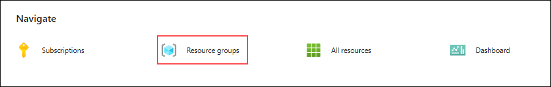
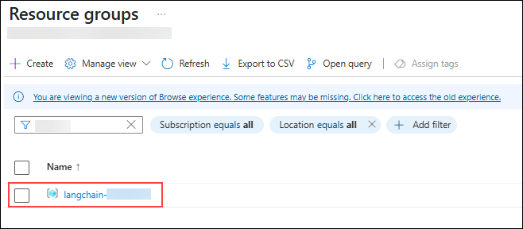
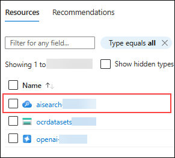
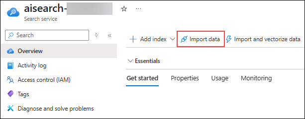
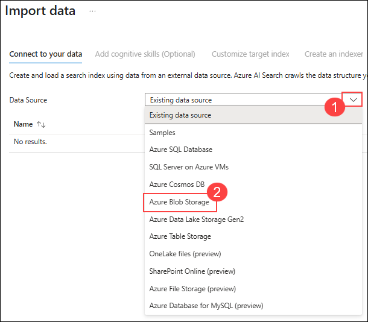
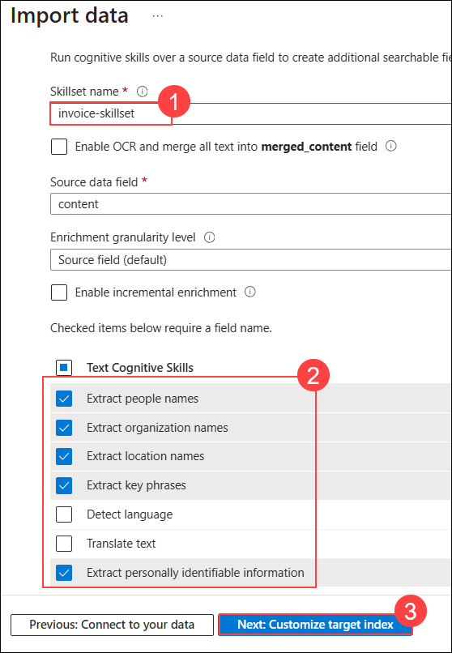
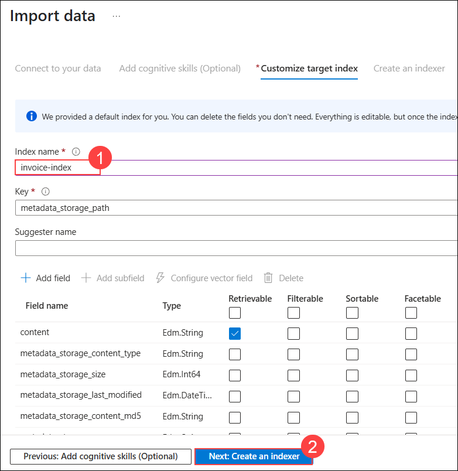
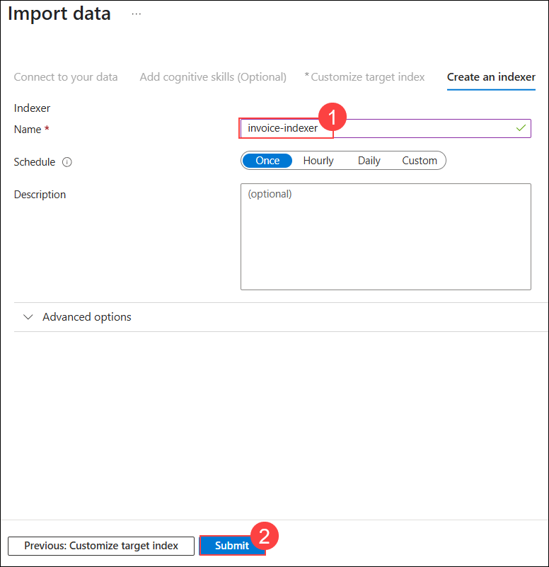
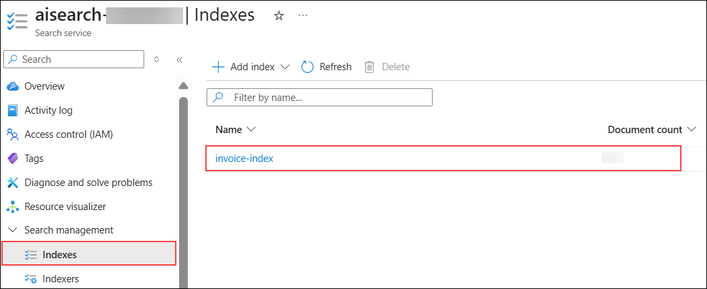
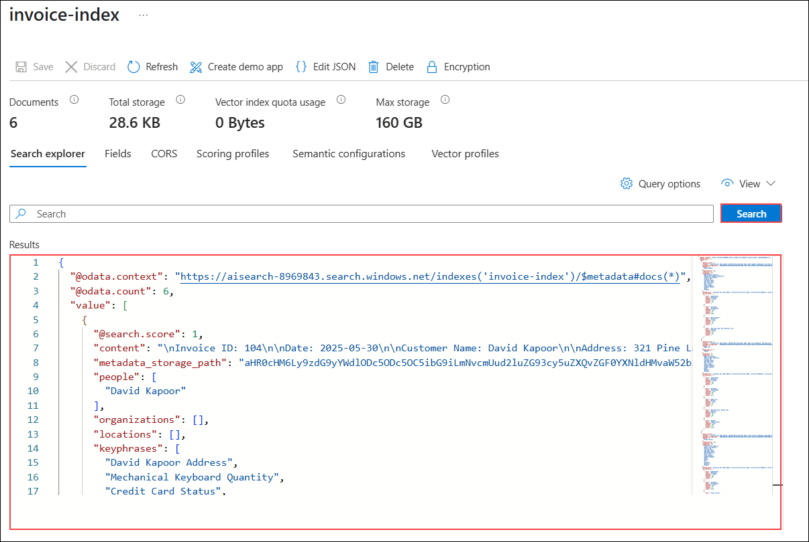

# Exercise 1: Content Ingestion & Index Creation

### Estimated Duration: 30 Minutes

## Overview

In this exercise, you will prepare your data foundation by uploading sample PDFs and images to Azure Blob Storage, and configuring Azure AI Search to ingest and process them. Using built-in OCR and text extraction capabilities, Azure AI Search will enrich the content and generate a searchable index. This indexed data will serve as the knowledge base for your chatbot, enabling grounded, document-aware responses in later exercises.

**Azure AI Search** service is a tool that uses artificial intelligence to quickly find and retrieve relevant information from large datasets, like documents or databases. It understands user queries, even if they're vague, and delivers accurate results by analyzing content and context. Think of it as a super-smart librarian who instantly finds the right books for you. For example, Azure AI Search can search invoices by customer name or product, making data retrieval fast and intuitive.

## Objectives

You will be able to complete the following tasks:

- Task 1: Define & Populate Search Index

## Task 1 : Define & Populate Search Index

In this task, you will ingest the data into Azure AI Search from the storage account and create an index using that. This will be used as the initial knowledge for retrival.

1. Once you are in the Azure Portal, scroll down and under Navigate, select **Resource groups** option.

   

1. Now, from the list, select **langchain-<inject key="Deployment ID" enableCopy="false"/>** resource group.

   

1. From the resource list, click on **aisearch-<inject key="Deployment ID" enableCopy="false"/>** AI Search service.

   

1. Once you are in the overview page of AI Search, click on **Import data**.

   

1. In **Connect to your data** pane, for **Data Source**, select **Azure Blob Storage** from the list.

   

1. In next pane, for **Skillset name (1)**, provide the name as `invoice-skillset`, make sure for Text Cognitive Skills, check the boxes for the options as Shown and Click on **Next: Customize target index (3)**.

   

1. In the next pane, provide the **Index name** as `invoice-index` **(1)** and click on **Next: Create an indexer (2)**.

   

1. In **Create an indexer** pane, provide the name as `invoice-indexer` **(1)** and click on **Submit (2)**.

   

1. Now, navigate to index page, select **Indexes** from the left menu, under **Search Management** and click on **invoice-index**.

   

   >**Note:** wait till the data is imported completly in the index (Till the document count is populated to some number).

1. Once you open the index, click on **Search**, this will search for all the documents and fields. You can goo through the output and check how the data is extracted and added in indexes.

   

## Summary

In this exercise, you prepared your data foundation by uploading sample PDFs and images to Azure Blob Storage and configuring Azure AI Search to ingest and process them. Using built-in OCR and text extraction capabilities, Azure AI Search enriched the content and generated a searchable index. This indexed data now serves as the knowledge base for your chatbot, enabling grounded, document-aware responses in later exercises.