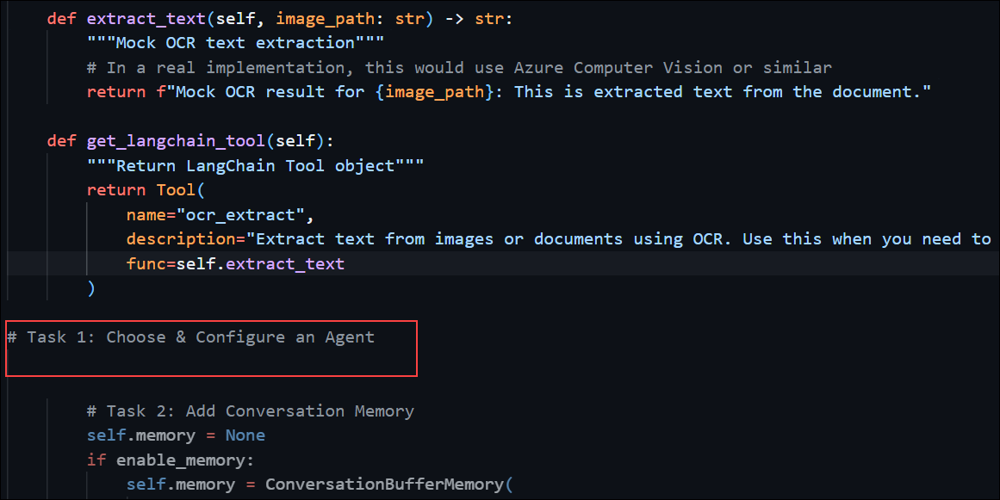

# Exercise 3: Agent Assembly & Memory

### Estimated Duration: 30 Minutes

## Overview

In this exercise, you will assemble a LangChain agent that can plan, remember, and explain its actions. You will configure a structured agent with tool access, integrate memory to support multi-turn dialogue, and instrument callbacks to trace and debug each step of the agent’s reasoning.

## Objectives

You will be able to complete the following tasks:

- Task 1: Choose & Configure an Agent

- Task 2: Add Conversation Memory

- Task 3: Instrument Callbacks for Observability

## Task 1: Choose & Configure an Agent

In this task, you will select a Structured Agent using LangChain’s create_react_agent function and register your Search and OCR tools. This will allow the agent to dynamically choose tools based on user input and execute them in sequence.

1. Navigate to the **Visual Studio Code** window, which you opened in the previous exercise.

1. Once you are in the **Visual Studio Code**, from the explorer, select `exercise3_agent_memory` file.

1. Once opened, navigate to `# Task 1: Choose & Configure an Agent` comment.

   

1. Add the following code snippet under the comment.

   ```python
   class InvoiceAgent:
    """Structured agent with tool access and memory"""
    
    def __init__(self, enable_memory=True, enable_callbacks=True):
        # Initialize LLM
        self.llm = AzureChatOpenAI(
            azure_endpoint=os.getenv("AZURE_OPENAI_ENDPOINT"),
            api_key=os.getenv("AZURE_OPENAI_KEY"),
            azure_deployment=os.getenv("AZURE_OPENAI_DEPLOYMENT"),
            api_version=os.getenv("AZURE_OPENAI_API_VERSION", "2024-02-01"),
            temperature=0.1
        )
        
        # Initialize tools
        self.search_tool = InvoiceSearchTool()
        self.retrieval_qa = InvoiceRetrievalQA()
        self.ocr_tool = OCRTool()
        
        # Create tools list
        self.tools = [
            self.search_tool.get_langchain_tool(),
            Tool(
                name="qa_retrieval",
                description="Answer detailed questions about invoices using retrieval and AI analysis. Use this for complex questions that need contextual understanding and reasoning.",
                func=self._qa_tool_wrapper
            ),
            self.ocr_tool.get_langchain_tool()
        ]


## Task 2: Add Conversation Memory

In this task, you will add ConversationBufferMemory to your agent so it can retain and reference prior conversation turns. This enables more natural, context-aware dialogue where earlier inputs influence future responses.

## Task 3: Instrument Callbacks for Observability

In this task, you will integrate LangChain’s CallbackHandler to monitor the agent’s execution. You will log each step—including planning, tool use, and response—to the console or Application Insights for transparency and easier debugging.

## Summary

In this exercise, you assembled a LangChain agent with dynamic planning, memory, and observability. You configured a Structured Agent with access to your tools, enabled memory to support multi-turn interactions, and used callbacks to trace each step in the agent's decision-making process.