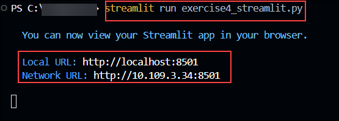
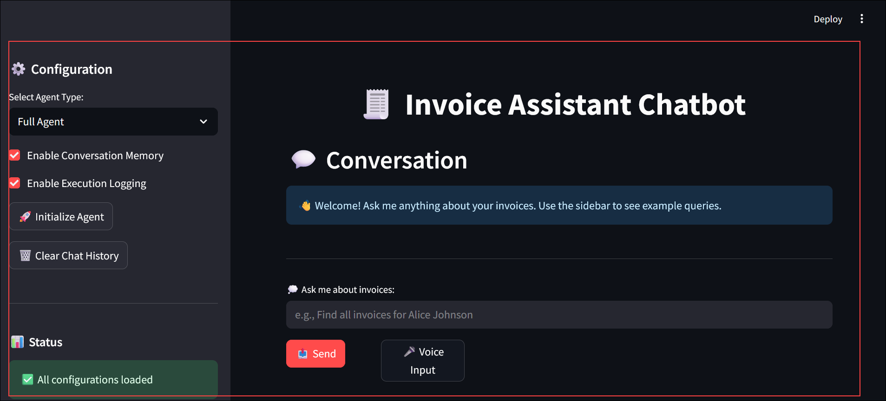
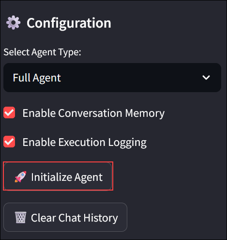
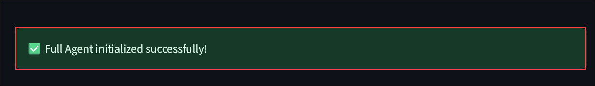
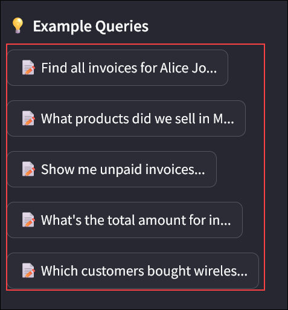
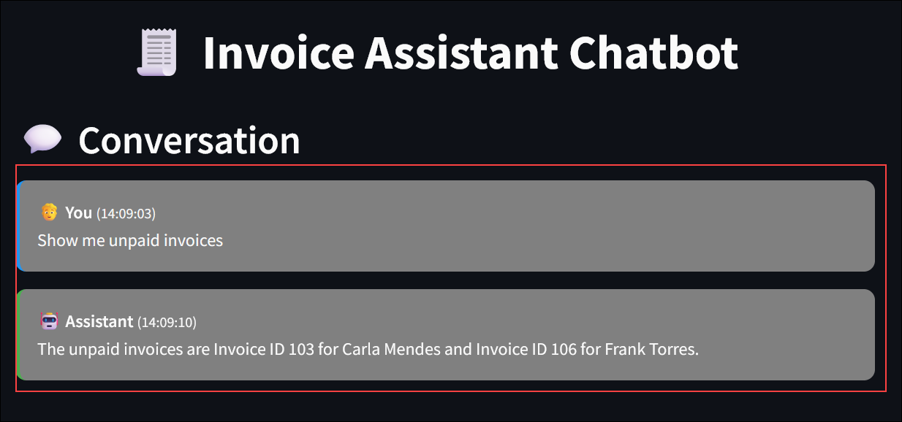
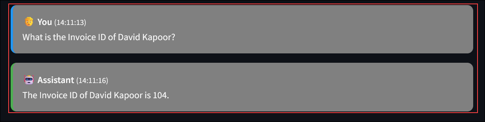
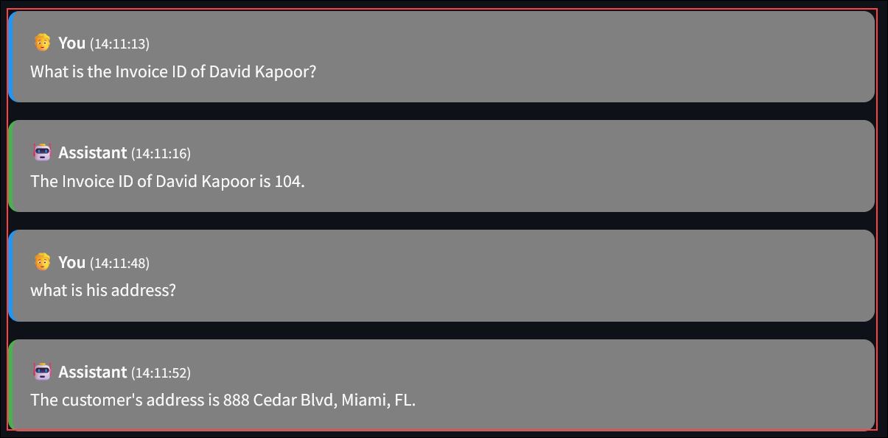
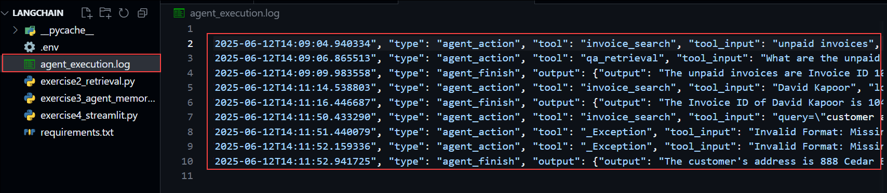

# Exercise 4: Deploying the bot with Streamlit

### Estimated Duration: 30 Minutes

## Overview

In this exercise, you will deploy your chatbot locally using Streamlit. You will create a simple web interface that connects to your LangChain-based agent and allows you to test the chatbot’s performance with real prompts in a user-friendly environment.

**Streamlit** is an open-source Python library that allows you to quickly build and deploy interactive web applications for data science, machine learning, and AI projects with minimal coding. It’s designed to turn Python scripts into shareable web apps using simple, intuitive syntax.

## Objectives

You will be able to complete the following tasks:

- Task 1: Set Up and Run Streamlit App

## Task 1: Set Up and Run Streamlit App

In this task, you will configure a basic Streamlit app that loads your RetrievalQA or agent chain and accepts user input. You will run the app locally, interact with the chatbot through the web interface, and verify that it responds accurately using your indexed content.

1. Now that you’ve set up the agent with all its capabilities, it’s time to host it as an application so that you can interact with it.

1. In **Visual Studio Code**, open `exercise4_streamlit` file from the explorer.

1. Once opened, you can see that the file is empty, now add the below code to complete the Streamlit setup.

   ```
    import streamlit as st
    import os
    from dotenv import load_dotenv
    from exercise3_agent_memory import InvoiceAgent
    from exercise2_retrieval import InvoiceRetrievalQA
    import json
    from datetime import datetime

    # Load environment variables
    load_dotenv()

    # Page configuration
    st.set_page_config(
        page_title="Invoice Assistant Chatbot",
        page_icon="🧾",
        layout="wide",
        initial_sidebar_state="expanded"
    )

    # Custom CSS for better styling
    st.markdown("""
    <style>
        .main-header {
            font-size: 2.5rem;
            color: #1f77b4;
            text-align: center;
            margin-bottom: 2rem;
        }
        .chat-message {
            padding: 1rem;
            border-radius: 10px;
            margin-bottom: 1rem;
        }
        .user-message {
            background-color: #808080;
            border-left: 4px solid #2196f3;
        }
        .bot-message {
            background-color: #808080;
            border-left: 4px solid #4caf50;
        }
        .sidebar-section {
            margin-bottom: 2rem;
        }
    </style>
    """, unsafe_allow_html=True)

    class StreamlitChatInterface:
        """Streamlit interface for the Invoice Assistant"""
        
        def __init__(self):
            self.initialize_session_state()
            self.setup_sidebar()
            self.main_interface()
        
        def initialize_session_state(self):
            """Initialize Streamlit session state variables"""
            if 'agent' not in st.session_state:
                st.session_state.agent = None
            if 'chat_history' not in st.session_state:
                st.session_state.chat_history = []
            if 'agent_type' not in st.session_state:
                st.session_state.agent_type = "Full Agent"
            if 'enable_memory' not in st.session_state:
                st.session_state.enable_memory = True
            if 'enable_callbacks' not in st.session_state:
                st.session_state.enable_callbacks = True
        
        def setup_sidebar(self):
            """Setup the sidebar with configuration options"""
            st.sidebar.markdown("## ⚙️ Configuration")
            
            # Agent type selection
            agent_type = st.sidebar.selectbox(
                "Select Agent Type:",
                ["Full Agent", "Simple RetrievalQA"],
                index=0 if st.session_state.agent_type == "Full Agent" else 1
            )
            
            # Memory and callback options
            enable_memory = st.sidebar.checkbox(
                "Enable Conversation Memory", 
                value=st.session_state.enable_memory
            )
            
            enable_callbacks = st.sidebar.checkbox(
                "Enable Execution Logging", 
                value=st.session_state.enable_callbacks
            )
            
            # Initialize/Reinitialize agent if settings changed
            if (agent_type != st.session_state.agent_type or 
                enable_memory != st.session_state.enable_memory or 
                enable_callbacks != st.session_state.enable_callbacks):
                
                st.session_state.agent_type = agent_type
                st.session_state.enable_memory = enable_memory
                st.session_state.enable_callbacks = enable_callbacks
                st.session_state.agent = None  # Force reinitialization
            
            # Initialize agent button
            if st.sidebar.button("🚀 Initialize Agent"):
                self.initialize_agent()
            
            # Clear chat history
            if st.sidebar.button("🗑️ Clear Chat History"):
                st.session_state.chat_history = []
                if st.session_state.agent and hasattr(st.session_state.agent, 'clear_memory'):
                    st.session_state.agent.clear_memory()
                st.rerun()
            
            # Configuration status
            st.sidebar.markdown("---")
            st.sidebar.markdown("### 📊 Status")
            
            # Check environment variables
            env_status = self.check_environment()
            if env_status['all_configured']:
                st.sidebar.success("✅ All configurations loaded")
            else:
                st.sidebar.error("❌ Missing configurations")
                for key, status in env_status['details'].items():
                    status_icon = "✅" if status else "❌"
                    st.sidebar.write(f"{status_icon} {key}")
            
            # Agent status
            if st.session_state.agent:
                st.sidebar.success(f"✅ {st.session_state.agent_type} initialized")
            else:
                st.sidebar.warning("⚠️ Agent not initialized")
            
            # Example queries
            st.sidebar.markdown("---")
            st.sidebar.markdown("### 💡 Example Queries")
            
            example_queries = [
                "Find all invoices for Alice Johnson",
                "What products did we sell in May 2025?",
                "Show me unpaid invoices",
                "What's the total amount for invoice 101?",
                "Which customers bought wireless mice?"
            ]
            
            for query in example_queries:
                if st.sidebar.button(f"📝 {query[:30]}...", key=f"example_{hash(query)}"):
                    self.process_message(query)
        
        def check_environment(self):
            """Check if all required environment variables are set"""
            required_vars = [
                "AZURE_OPENAI_ENDPOINT",
                "AZURE_OPENAI_KEY", 
                "AZURE_OPENAI_DEPLOYMENT",
                "AZURE_SEARCH_ENDPOINT",
                "AZURE_SEARCH_KEY",
                "AZURE_SEARCH_INDEX_NAME"
            ]
            
            details = {}
            for var in required_vars:
                details[var] = bool(os.getenv(var))
            
            return {
                'all_configured': all(details.values()),
                'details': details
            }
        
        def initialize_agent(self):
            """Initialize the selected agent type"""
            try:
                with st.spinner("Initializing agent..."):
                    if st.session_state.agent_type == "Full Agent":
                        st.session_state.agent = InvoiceAgent(
                            enable_memory=st.session_state.enable_memory,
                            enable_callbacks=st.session_state.enable_callbacks
                        )
                    else:
                        st.session_state.agent = InvoiceRetrievalQA()
                    
                    st.success(f"✅ {st.session_state.agent_type} initialized successfully!")
                    
            except Exception as e:
                st.error(f"❌ Error initializing agent: {str(e)}")
                st.session_state.agent = None
        
        def main_interface(self):
            """Main chat interface"""
            st.markdown('<h1 class="main-header">🧾 Invoice Assistant Chatbot</h1>', 
                    unsafe_allow_html=True)
            
            # Display chat history
            self.display_chat_history()
            
            # Chat input
            self.chat_input_section()
            
            # Agent information
            if st.session_state.agent:
                self.display_agent_info()
        
        def display_chat_history(self):
            """Display the chat history"""
            st.markdown("## 💬 Conversation")
            
            if not st.session_state.chat_history:
                st.info("👋 Welcome! Ask me anything about your invoices. Use the sidebar to see example queries.")
                return
            
            for message in st.session_state.chat_history:
                timestamp = message.get('timestamp', '')
                
                if message['role'] == 'user':
                    st.markdown(f"""
                    <div class="chat-message user-message">
                        <strong>🧑 You</strong> <small>({timestamp})</small><br>
                        {message['content']}
                    </div>
                    """, unsafe_allow_html=True)
                else:
                    st.markdown(f"""
                    <div class="chat-message bot-message">
                        <strong>🤖 Assistant</strong> <small>({timestamp})</small><br>
                        {message['content']}
                    </div>
                    """, unsafe_allow_html=True)
        
        def chat_input_section(self):
            """Chat input section"""
            st.markdown("---")
            
            # Chat input
            user_input = st.text_input(
                "💭 Ask me about invoices:",
                placeholder="e.g., Find all invoices for Alice Johnson",
                key="chat_input"
            )
            
            col1, col2, col3 = st.columns([1, 1, 4])
            
            with col1:
                send_button = st.button("📤 Send", type="primary")
            
            with col2:
                if st.button("🎤 Voice Input"):
                    st.info("Voice input feature coming soon!")
            
            # Process message
            if send_button and user_input:
                self.process_message(user_input)
                st.rerun()
        
        def process_message(self, user_input):
            """Process user message and get agent response"""
            if not st.session_state.agent:
                st.error("Please initialize the agent first using the sidebar.")
                return
            
            # Add user message to history
            timestamp = datetime.now().strftime("%H:%M:%S")
            st.session_state.chat_history.append({
                'role': 'user',
                'content': user_input,
                'timestamp': timestamp
            })
            
            # Get agent response
            try:
                with st.spinner("🤔 Thinking..."):
                    if st.session_state.agent_type == "Full Agent":
                        response = st.session_state.agent.chat(user_input)
                    else:
                        result = st.session_state.agent.query(user_input)
                        response = result["answer"]
                    
                    # Add agent response to history
                    st.session_state.chat_history.append({
                        'role': 'assistant',
                        'content': response,
                        'timestamp': datetime.now().strftime("%H:%M:%S")
                    })
                    
            except Exception as e:
                error_message = f"Sorry, I encountered an error: {str(e)}"
                st.session_state.chat_history.append({
                    'role': 'assistant',
                    'content': error_message,
                    'timestamp': datetime.now().strftime("%H:%M:%S")
                })
        
        def display_agent_info(self):
            """Display agent information and statistics"""
            if not st.session_state.agent:
                return
            
            st.markdown("---")
            st.markdown("## 📊 Agent Information")
            
            col1, col2, col3 = st.columns(3)
            
            with col1:
                st.metric(
                    label="Agent Type",
                    value=st.session_state.agent_type
                )
            
            with col2:
                st.metric(
                    label="Chat Messages",
                    value=len(st.session_state.chat_history)
                )
            
            with col3:
                memory_status = "Enabled" if st.session_state.enable_memory else "Disabled"
                st.metric(
                    label="Memory",
                    value=memory_status
                )
            
            # Display execution log for Full Agent
            if (st.session_state.agent_type == "Full Agent" and 
                hasattr(st.session_state.agent, 'get_execution_log')):
                
                with st.expander("🔍 View Execution Log", expanded=False):
                    execution_log = st.session_state.agent.get_execution_log()
                    if execution_log:
                        st.json(execution_log[-5:])  # Show last 5 entries
                    else:
                        st.info("No execution log entries yet.")

    def main():
        """Main function to run the Streamlit app"""
        try:
            # Check if environment variables are loaded
            if not os.getenv("AZURE_OPENAI_ENDPOINT"):
                st.error("⚠️ Environment variables not loaded. Make sure you have a .env file with all required configurations.")
                st.stop()
            
            # Initialize the chat interface
            StreamlitChatInterface()
            
        except Exception as e:
            st.error(f"❌ Application error: {str(e)}")
            st.info("Please check your configuration and try again.")

    if __name__ == "__main__":
        main()
   ```
   >The StreamlitChatInterface class creates a web-based chat interface for the InvoiceAgent or InvoiceRetrievalQA using Streamlit.

   >It loads environment variables, sets up a styled UI with a sidebar for agent configuration (type, memory, callbacks), and displays chat history.

   >Users can select between "Full Agent" or "Simple RetrievalQA", initialize the agent, clear chat history, and use example queries.

   >The process_message method handles user input, gets agent responses, and logs interactions with timestamps in session state.

   >It includes error handling, environment variable checks, and metrics like agent type and message count.

   >The main function ensures proper setup and runs the app, stopping if configurations are missing.

1. Once added, save the file using **CTRL + S**.

1. Once saved, now run the following command to run the agent application.

   ```
   streamlit run exercise4_streamlit.py
   ```

   

1. Once after running, you will be navigated to the Web UI of the agent.

   

1. From the left menu, click on **Initialize Agent** to start the agent.

   

   > Wait for few seconds till the agent initializes completly and you will get a message like this.

   

1. On the left menu, if you scroll down, you can see there are some example queries listed, you can use them, just by clicking on them.

   

   

1. Once done, you can also give the prompt the chat area to experiment with it. Copy the below prompt and use it to get the answers.

   ```
   What is the Invoice ID of David Kapoor?
   ```

   

1. Now ask a add on question to the previous one to check if the memory is equipped for the agent.

   ```
   what is his address? 
   ```

   

1. You can see that, the agent is now getting the address of David Kapoor automatically.

1. Now you have successfully developed a agent using **Langchain**. You can also see the calls done by the application and logs by navigating back to visual studio code, and opening the `agent_execution` file.

   
   
## Summary

In this exercise, you deployed your chatbot locally using Streamlit. You created a simple frontend to interact with the LangChain agent and successfully tested its ability to respond to prompts grounded in the indexed data.